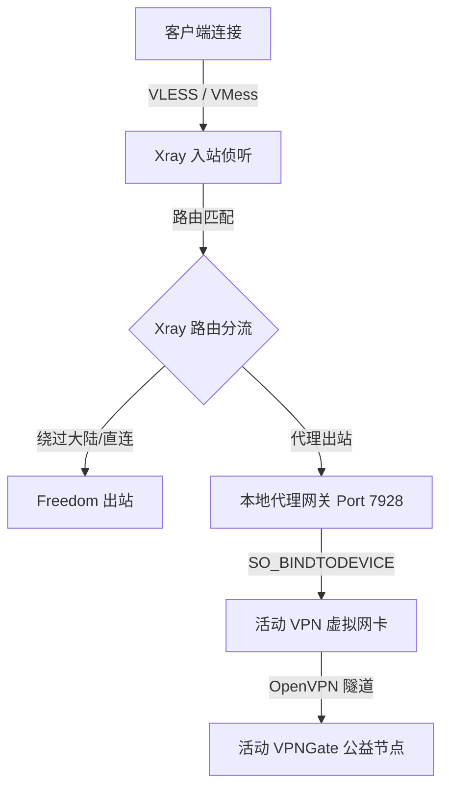

# AimiliVPN 开发者与 AI 助手指令集 (AI Prompt & Developer Instructions)

本文件整合了 AimiliVPN 的核心架构、目录结构、开发规范及工作流程，作为未来 AI 助手在此代码库进行开发、调试和优化时的系统指令集（System Prompt Context）。

---

## 📌 1. 项目定位与核心愿景 (Vision)

AimiliVPN 是一个基于 **Docker + Xray + OpenVPN (VPNGate)** 的高集成度、轻量级、多用户代理及公共网关管理系统。
* **Xray Core**: 负责多协议入站管理（VLESS-Reality, VMess-WS-TLS, SOCKS5 等）、用户凭证管理、订阅链接分发与高级路由规则拦截。
* **OpenVPN (VPNGate)**: 负责动态公共出站。通过后台线程定期从 VPNGate API 拉取、并发测试筛选可用节点，建立加密的 VPN 出站隧道。
* **Docker 容器化**: 一键式完整面板容器部署（`AIMILI_SERVICE_MODE=full`），通过 `host` 网络模式直接与宿主机网卡无缝交互，支持 NET_ADMIN 级虚拟网卡操作。

---

## 📂 2. 目录结构与核心模块 (Directory Structure)

- **/backend**: 后端主控及 API 服务（Python 3.12）。
  - `vpngate_manager.py`: 主程序入口。
  - `app/main.py`: 生命周期管理、主进程信号捕获、日志重定向（`Tee` 类）及 Dual-stack HTTPServer 启动。
  - `app/core/vpn.py`: 核心逻辑。负责 VPNGate 节点解析、并发筛选、多进程 OpenVPN 控制、出口连通性测试以及 Linux 路由表 100 策略路由管理。
  - `app/core/xray.py`: 负责 xray-core 配置编译、进程生命周期控制、Reality 与 ML-DSA-65 密钥对生成、Xray 订阅生成。
  - `app/api/`: 基于原生 Python HTTP 库实现的 REST API 接收端与路由控制。
- **/proxy**: 本地代理转换网关。
  - `server.py`: 原生 Python socket 实现的 HTTP/SOCKS5 代理。监听 `7928`（默认）端口，通过 `SO_BINDTODEVICE` 将出站流量强行绑定至当前的活动 OpenVPN 网卡。实现 DNS Over VPN 功能。
- **/cli**: 命令行终端工具。
  - `menu.py`: 终端交互菜单 `ml`。供管理员在 SSH 终端进行 BBR 配置、节点手动切换、状态监控和日志实时排查。
- **/web**: 面板网页前端。
  - 原生 HTML/JS 静态文件（`index.html`, `login.html` 及 JS 模块），提供仪表盘、出站管理、订阅管理和面板设置。
- **/docker**: 容器配置。
  - `full/Dockerfile`: 编译并预装 Python 依赖、Xray 二进制、OpenVPN 等组件。
  - `full/entrypoint.sh`: 首次启动时自动生成随机面板账号、密码与 Web 安全后缀。

---

## ⚙️ 3. 核心工作流与转发机制 (Workflow)

1. **客户端接入**: 客户端通过 VLESS-Reality、VMess 或 SOCKS5 连接至面板。
2. **Xray 分流决策**: Xray Core 解析入站流量，并根据用户配置的路由规则分流：
   - 规则匹配直连或广告拦截。
   - 规则匹配代理出口时，转发至本地 `127.0.0.1:7928` 本地代理转换网关。
3. **本地代理强行绑定**: 本地代理网关（`/proxy/server.py`）接收到流量后，创建出站套接字，通过 `setsockopt(socket.SOL_SOCKET, socket.SO_BINDTODEVICE)` 绑定至当前活动的 VPN 网卡设备（如 `tun0`, `tun1` 等），强制流量进入 OpenVPN 隧道出口。

---

## ⚠️ 4. AI 助手开发与修复红线 (Directives)

未来在对此代码库进行修改时，**必须严格遵守**以下红线以防止重构引入 Bug：

1. **绝对禁止硬编码出口网卡为 `"tun0"`**:
   - 系统必须通过 `utils/vpn.py` 中的 `ACTIVE_TUN_DEVICE` 动态跟踪当前活动的网卡。
   - 在 `run_openvpn_until_ready` 中解析日志以捕获实际分配的设备名，并将结果写入 `vpn_utils.ACTIVE_TUN_DEVICE`，供代理网关、流量统计和状态 API 读取。
2. **严防并发测速时的文件写竞态**:
   - 手动或健康检查并发测速时，禁止覆盖节点的默认静态 `config_file` 路径。
   - 必须通过 `uuid.uuid4().hex[:8]` 生成独一无二的临时 `.ovpn` 配置文件，并在测速连接结束或失败时在 `finally` 块中确保将其 `unlink` 删除。
3. **SOCKS5 应答解析必须符合 RFC 1928**:
   - 代理回包处理必须严格读取前 4 字节的应答头判定 `ATYP`：
     - `ATYP = 1`: 读取 6 字节。
     - `ATYP = 3`: 先读取 1 字节长度，再读取 `length + 2` 字节。
     - `ATYP = 4`: 读取 18 字节。
   - 禁止盲目指定 `recv(10)`，以防止在 IPv6 (22 字节) 或域名应答时因缓冲区残留回包字节导致后续 TLS 握手（例如获取 API 列表时）发生协议紊乱崩溃。
4. **健壮的启动端口及 Host Fallback 处理**:
   - 在 `backend/app/main.py` 的最后启动 DualStackHTTPServer 前，不得重新覆盖 `ui_host` 和 `ui_port`，必须复用顶部经过 try-except 安全转换和 `os.environ` 环境变量回退处理好的局部变量。
